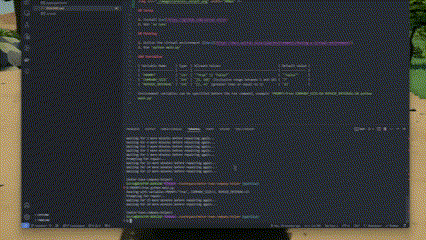

# motor-town-company-helper

A simple Python script which helps reduce the _pain_ of managing a company within the game Motor Town. This script will automatically repair your company vehicles without you needing it manage it yourself.

## Setup

1. Install [uv](https://github.com/astral-sh/uv)
1. Run `uv sync`

## Running

1. Active the virtual environment ([docs](https://docs.astral.sh/uv/pip/environments/#using-a-virtual-environment))
1. Run `python main.py`

### Variables

| Variable Name     | Type  | Allowed Values                               | Default Value |
| ----------------- | ----- | -------------------------------------------- | ------------- |
| `PROMPT`          | `str` | `"True" \| "False"`                          | `"False"`     |
| `COMPANY_SIZE`    | `int` | `[1, 10]` (inclusive range between 1 and 10) | `7`           |
| `REPAIR_INTERVAL` | `int` | `[1, ∞)` (greater than or equal to 1)        | `15`          |

~~Environment variables can be specified before the run command, example `PROMPT=True COMPANY_SIZE=10 REPAIR_INTERVAL=20 python main.py`~~ [^1][^2]

## Config File
The config.ini file will have 2 different sections[^2]
### Section 1 - Settings
This section is the default variables from above [^2]
| Variable Name     | Type  | Allowed Values                               | Default Value |
| ----------------- | ----- | -------------------------------------------- | ------------- |
| `PROMPT`          | `str` | `"True" \| "False"`                          | `"False"`     |
| `COMPANY_SIZE`    | `int` | `[1, 10]` (inclusive range between 1 and 10) | `7`           |
| `REPAIR_INTERVAL` | `int` | `[1, ∞)` (greater than or equal to 1)        | `15`          |

### Section 2 - Game Keys
This section is for players who use custom keys and need to change the keys without messing with the code[^2]

[^1]: These Environment variables does not work therefore a config was made to run these values
[^2]: Contribution made by MrJohnDowe
